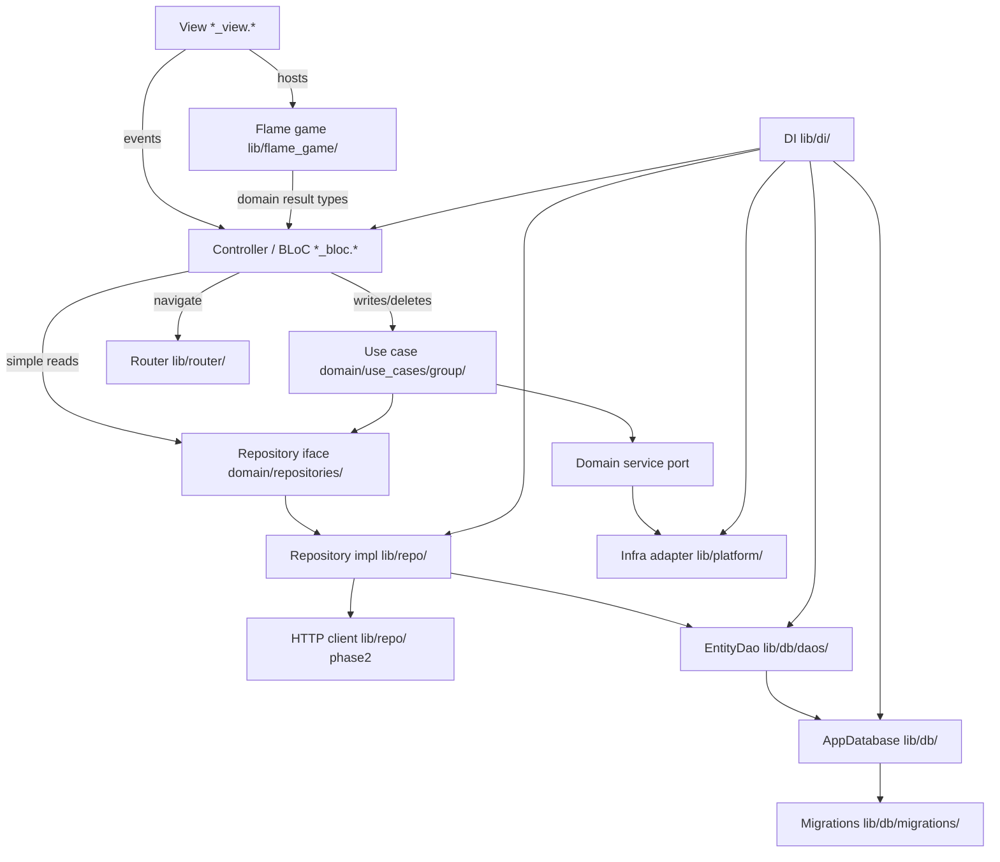

# Architecture — Fine Motor

Fine Motor is a patient-only iOS/Android tremor-test app: predefined
dragging and tapping tests built with Flutter Flame, scored and stored
locally (offline-first). Phase 2 syncs results to a doctor website via API.
Architecture is layered: the domain is pure and every other layer depends
inward. One install equals one patient — no identity in phase 1.

## Layers

Order layers from innermost (most pure, fewest dependencies) to outermost.

| Layer | Directory | Responsibility | May depend on |
|-------|-----------|----------------|---------------|
| Domain | `lib/domain/` | Entities, models, repository interfaces, service ports, use cases (grouped under `use_cases/`), non-trivial logic under `business/` when extracted from use cases, formatters, validators. Pure — no framework. | (nothing internal) |
| Data-access | `lib/repo/` | Repository implementations that fulfil domain interfaces. Local DAO orchestration in phase 1; HTTP client reserved for phase-2 sync. | Domain, DB |
| Persistence | `lib/db/` | Connection (`AppDatabase`), schema, migrations, DAOs — one DAO per table/aggregate. | Domain |
| Infra adapters | `lib/platform/` | OS/plugin adapters implementing domain service ports. | Domain |
| Games | `lib/flame_game/` | Flame tremor-test components and game wiring helpers. Emits domain result types; does not persist. | Domain |
| Presentation | `lib/screens/` | Views + BLoCs. Views render; BLoCs hold logic and navigation. Hosts Flame games via screen views. | Domain, router, di, theme, l10n, flame_game |
| Cross-cutting | `lib/router/`, `lib/di/`, `lib/theme/`, `lib/logger/`, `lib/l10n/` | Routing, dependency injection, design tokens, shared logger, gen-l10n (ARB). | Domain + presentation as needed |

## Core rules

1. **BLoC** performs writes/deletes through a **use case** and simple reads
   through a **repository interface**.
2. **All navigation happens in BLoCs** — never in views or shared widgets.
   Every screen must be registered with a route in `lib/router/`. Views only
   dispatch events (e.g. `backTapped`); the BLoC navigates by calling the
   router with that registered route. Views must not import the router or
   navigation package.
3. **No infrastructure in BLoCs or views** — infrastructure is reached only
   through domain ports implemented in `lib/platform/` / `lib/repo/`. Flame
   game code lives in `lib/flame_game/`; views may host a game widget, but
   BLoCs must not import sqflite, http, path_provider, shared_preferences, or
   similar plugins.
4. **The domain is pure** — it must not import any outer layer or framework.
5. **API HTTP calls** are made from `lib/repo/` (not from controllers/views).
   Completion logging is centralized in the shared HTTP client — see AGENTS.md
   for format (`Success …` / `Failed …`; `logger.i` / `logger.w`). Temporary
   diagnostic logs: `logger.d` only — remove before finishing. Phase 1 does
   not call the API; the client and logging path are prepared for phase 2.
6. **Database exceptions are always caught** — at `lib/db/` (open, migrations,
   DAOs) and at any other call site that talks to the DB. Never leave them
   uncaught. On app startup, wrap DB init in `try`/`catch`. On failure show
   `DatabaseError` screen with **Retry** (re-open) and **Wipe** (delete the
   DB file, then re-open so migrations recreate the schema). See
   `docs/agent-guidelines/07-database-exceptions.md`.
7. **Flame games** under `lib/flame_game/` may depend on domain types for
   scores/results. They must not import repo, db, router, or di. Screens/BLoCs
   start tests and persist results via use cases — never write from Flame
   components directly to the database.

## Domain model (phase 1)

Catalog levels and core persisted result (`LevelEnum` finalized with the
catalog):

```dart
enum LevelEnum {
  drawShapes,
}

class MotorTest {
  final String title;
  final LevelEnum level;
  final String description;
}

class TestResult {
  final LevelEnum level;
  final double totalScore;
  final Duration duration;
  final DateTime timestamp;
  final double smallShakeScore;
  final double mediumShakeScore;
  final double strongShakeScore;
}
```

Motor-test catalog metadata is persisted in `motor_tests`. The v1
`onCreate` path seeds `LevelEnum.drawShapes` through `MotorTestsSeeder`;
Catalog reads it through `MotorTestRepository`.

## Logger setup

Centralize the `logger` package in `lib/logger/logger.*`. Configure
`PrettyPrinter` with a short stack trace from the log call site:

```dart
import 'package:logger/logger.dart';

final logger = Logger(
  printer: PrettyPrinter(
    methodCount: 1,
    errorMethodCount: 1,
    lineLength: 120,
  ),
);
```

## Strict import table

This is the authoritative deny-list. For each file group, list the import
prefixes it must **not** contain. The lint-rules class and architecture test
encode exactly this table.

- **`lib/domain/**`** must not import: Flutter / `package:flutter`,
  `lib/screens/`, `lib/repo/`, `lib/db/`, `lib/platform/`, `lib/flame_game/`,
  `lib/router/`, `lib/di/`, `lib/theme/`, flutter_bloc.
- **`lib/repo/**`** must not import: Flutter / `package:flutter`,
  `lib/screens/`, `lib/router/`, `lib/di/`, flutter_bloc, `lib/flame_game/`.
- **`lib/db/**`** must not import: Flutter / `package:flutter`,
  `lib/screens/`, `lib/repo/`, `lib/router/`, `lib/di/`, flutter_bloc,
  `lib/flame_game/`.
- **`lib/platform/**`** must not import: `lib/screens/`, `lib/repo/`,
  `lib/db/`, `lib/router/`, `lib/di/`, flutter_bloc, `lib/flame_game/`.
- **`lib/flame_game/**`** must not import: `lib/screens/`, `lib/repo/`,
  `lib/db/`, `lib/router/`, `lib/di/`, flutter_bloc, go_router.
- **Views (`*_view.*`)** must not import: `lib/repo/`, `lib/db/`,
  `lib/router/`, `lib/di/`, go_router / Navigator navigation APIs.
- **Controllers (`*_bloc.*` / `*_event.*` / `*_state.*`)** must not import:
  `lib/repo/`, `lib/db/`, go_router / Navigator navigation APIs, sqflite, http,
  path_provider, shared_preferences, and other infrastructure plugins.
- **Shared components** must not import: `lib/repo/`, `lib/db/`,
  `lib/router/`, `lib/di/`, flutter_bloc, go_router / Navigator navigation APIs.

## Data flow



Domain interfaces (`Repo`, `Port`, `UseCase`) live in the domain layer;
`RepoImpl` and `Platform` implement them from outer layers and are wired in
`lib/di/`. Repository impls call **DAOs** (not raw `Database`); DAOs return
domain entities directly. Flame games return domain result types to the
hosting screen/BLoC; persistence goes through use cases.

## Remote DTOs

JSON DTOs (`json_serializable`) belong in the repo/HTTP path. Map to domain
entities before crossing into controllers. DAOs continue to own SQL and return
domain entities — see `docs/agent-guidelines/03-serialization.md`. Phase 1 has
no remote DTOs; introduce them with phase-2 sync.

### Persistence layout (`lib/db/`)

```
lib/db/
├── app_database.*          # connection, version, transaction()
├── schema/tables.*         # CREATE TABLE DDL
├── migrations/             # incremental upgrade steps
└── daos/<entity>_dao.*     # one DAO per table — SQL CRUD
```

- **`AppDatabase`** — open/close, `onCreate`/`onUpgrade`, `transaction()` for
  cross-DAO writes. No per-table queries. Expose wipe/delete-file for the
  DatabaseError screen.
- **`<Entity>Dao`** — table-specific SELECT/INSERT/UPDATE/DELETE; maps query
  results to domain entities.
- **Repository impls** — the only callers of DAOs; may combine local DAO data
  with remote HTTP responses (phase 2).

### Read path (example)

1. BLoC calls `TestResultRepository.getAll()` (domain interface).
2. `TestResultRepositoryImpl` calls `TestResultDao.findAll()` → domain
   `TestResult` list.
3. Phase 2 may merge remote data via HTTP before returning.
4. BLoC receives domain types only.

### Write path (example)

1. After a Flame test completes, BLoC dispatches to `SaveTestResultUseCase`.
2. Use case calls `TestResultRepository.save(result)`.
3. `TestResultRepositoryImpl` calls `TestResultDao.upsert(result)`.
4. Cross-table write: `AppDatabase.transaction((db) async { ... })` with DAOs
   receiving the transactional `db` handle.

### Example snippets

`app_database.*` — connection shell only (callers must catch; open can throw):

```dart
class AppDatabase {
  static const _version = 1;
  Database? _db;

  Future<Database> get database async => _db ??= await _open();

  Future<Database> _open() async { /* sqflite openDatabase / onCreate / onUpgrade */ }

  Future<void> wipe() async {
    await _db?.close();
    _db = null;
    // delete database file from disk, then callers re-open via `database`
  }

  Future<T> transaction<T>(Future<T> Function(Database db) action) async {
    final db = await database;
    return db.transaction((txn) => action(txn));
  }
}
```

`main.*` — wrap startup DB init; on failure show DatabaseError with Retry/Wipe:

```dart
Future<void> main() async {
  WidgetsFlutterBinding.ensureInitialized();
  try {
    await configureDependencies(); // opens / registers AppDatabase
  } on DatabaseException catch (e, st) {
    logger.w('Failed opening database on startup', error: e, stackTrace: st);
    runApp(DatabaseErrorApp(
      onRetry: () async { /* re-open / reconfigureDependencies */ },
      onWipe: () async { /* AppDatabase.wipe() then re-open / remigrate */ },
    ));
    return;
  }
  runApp(const MyApp());
}
```

`daos/test_result_dao.*` — per-table CRUD:

```dart
class TestResultDao {
  TestResultDao(this._appDb);
  final AppDatabase _appDb;

  Future<List<TestResult>> findAll({Database? db}) async { ... }
  Future<void> upsert(TestResult result, {Database? db}) async { ... }
}
```

`repo/test_result_repository_impl.*` — orchestrates DAO (+ HTTP in phase 2):

```dart
class TestResultRepositoryImpl implements TestResultRepository {
  TestResultRepositoryImpl(this._testResultDao, this._http);
  final TestResultDao _testResultDao;
  final HttpClient _http; // unused in phase 1

  @override
  Future<List<TestResult>> getAll() async {
    return _testResultDao.findAll();
  }
}
```

`di/di.*` — split registration into private helpers (`_registerSingletons`,
`_registerUseCases`, `_registerScreens`, …), group entries with section
comments (e.g. `// results use cases`), and call those helpers from one public
startup method run from `main` before `runApp`. Inside `_registerSingletons`,
order is AppDatabase → DAOs → repository impls / platform adapters:

```dart
Future<void> configureDependencies() async {
  _registerSingletons();
  _registerUseCases();
  _registerScreens();
}

void _registerSingletons() {
  // database
  getIt.registerLazySingleton<AppDatabase>(() => AppDatabase());
  getIt.registerLazySingleton<TestResultDao>(() => TestResultDao(getIt()));

  // results repos
  getIt.registerLazySingleton<TestResultRepository>(
    () => TestResultRepositoryImpl(getIt(), getIt()),
  );
}

void _registerUseCases() {
  // results use cases
  getIt.registerLazySingleton(() => SaveTestResultUseCase(getIt()));
}

void _registerScreens() {
  // shell / home screens
  getIt.registerFactory(() => HomeBloc(getIt()));
}
```

## Changing a boundary

A boundary change is a three-file change, all in the same commit:

1. Update the **Strict import table** above.
2. Update the deny-lists in `finemotor_lint_rules` (see
   [enforcement.md](agent-guidelines/enforcement.md)).
3. Update / re-run `test/architecture/import_boundaries_test.dart`.

If they disagree, the table wins and the other two are bugs.
